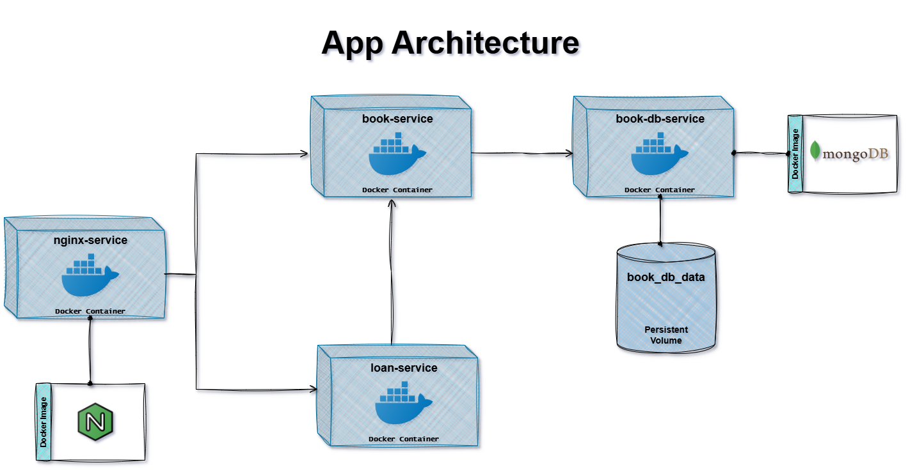

# Docker Node.js Demo

The repo is focusing on building and managing microservices with Node.js, Docker, and Docker Compose. It has five branches (including main), main branch is the complete implementation, whereas others lead to main in steps.

## Table of Contents

- [Docker Node.js Demo](#docker-nodejs-demo)
  - [Table of Contents](#table-of-contents)
  - [App Architecture - Diagram](#app-architecture---diagram)
  - [About part-1](#about-part-1)
  - [About part-2](#about-part-2)
  - [About part-3](#about-part-3)
  - [About part-4](#about-part-4)
  - [About main](#about-main)

## App Architecture - Diagram

## About part-1 

This branch implements the setup (`Dockerfile`) to create an image and then run a contaniner (`book-service-con`).

## About part-2

This branch integrates the database (mongodb) with the container `book-service-con` using the official [mongo](https://hub.docker.com/_/mongo) image. Instead of manually running containers, we are using Docker Compose to start them as services for us. It has `compose.yaml` file.

## About part-3

This branch demonstrates how containers can talk to each other using http requests. In `compose.yaml`, we have defined another service `loan-service` which uses http requests (`fetch()`) to talk to `book-service`.

## About part-4

In this branch, we have implemented **reverse proxy** by creating a separate service (`nginx-service`) which uses the official image [nginx](https://hub.docker.com/_/nginx). Also in `compose.yaml` file, the service `nginx-service` uses file-bind-mount for `nginx.conf` to configure it.

## About main

In `main` branch, we :
1. hard-coded the exact version of base images used in Dockerfile.
2. built the images again but with proper naming that is allowed for pushing images into Docker Hub.
3. pushed the images in our Docker Hub account as repos.
4. made the services (in `compose.yaml`) to pull images from Docker Hub (our repo) instead of building them locally.

